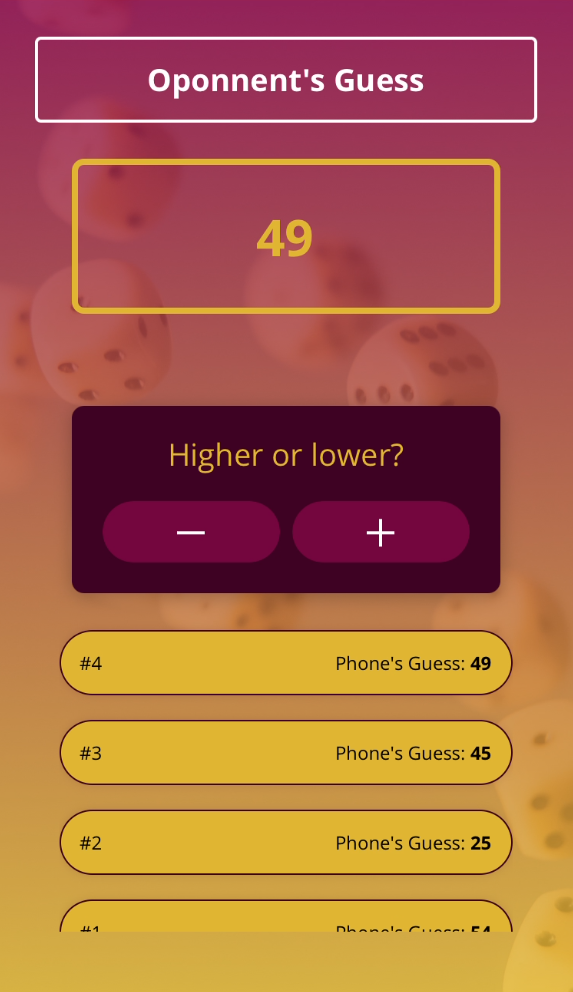

# Guess My Number! 🎲 

> Jogo feito em React Native de adivinhação onde o usuário insere um número e dá dicas ao seu celular para que seja descoberto.

### Ajustes e melhorias

O projeto ainda está em desenvolvimento e as próximas atualizações serão voltadas nas seguintes tarefas:

- [x] Implementação da lógica e das telas do jogo
- [x] Utilização de elementos genéricos e reutilizáveis
- [ ] Otimização para visualização em diferentes tipos de telas e orientação

## 💻 Pré-requisitos

Antes de começar, verifique se você atendeu aos seguintes requisitos:

* Você instalou a versão mais recente de `Node.js` e tem, ao menos, um simulador de `Android` ou `iOS`

## 🚀 Instalando Guess My Number

Para instalar o Guess My Number, siga estas etapas:

* Clone esse repositório com `git clone https://github.com/gguilhermelopes/react-native-mini-game-app`
* `cd react-native-mini-game-app`
* Instale as dependências com `npm install`

## ☕ Usando Guess My Number

Para usar Guess My Number, siga estas etapas:

* Certifique-se de que tem ao menos um simulador de `Android` ou `iOS` aberto
* Se não possuir, utilize o app `Expo Go` no seu celular `Android` ou `iOS` e esteja na mesma rede Wi-Fi de sua máquina
* Insira `npm start` na pasta do projeto. 
* Se utilizar um simulador, insira `a` para abrir o projeto no `Android` e/ou `i` para abrir no `iOS`
* Se utilizar o celular, scaneie o QR code indicado na linha de comando para que o app seja carregado

